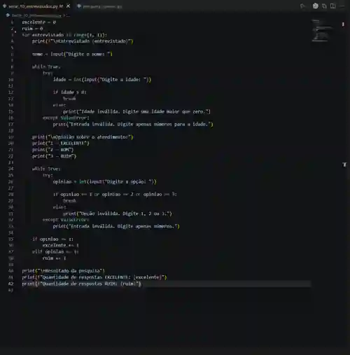
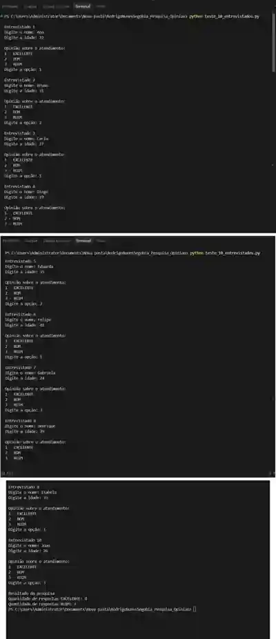

# Pesquisa de Opinião - TudoWeb

Projeto desenvolvido em Python para uma atividade da Agenda de Desenvolvimento de Sistemas.

A proposta é realizar uma pesquisa de satisfação da empresa TudoWeb com seus clientes. O programa solicita o nome, a idade e a opinião de cada entrevistado sobre o atendimento recebido.

## Opções da pesquisa

- `1` - EXCELENTE
- `2` - BOM
- `3` - RUIM

A versão final está preparada para realizar a pesquisa com **50 entrevistados**. Ao final, o programa exibe a quantidade de respostas **EXCELENTE** e **RUIM**.

Também foram adicionadas validações para impedir letras na idade e na avaliação, além de aceitar somente as opções 1, 2 ou 3.

## Conceitos utilizados

Foram utilizadas estruturas de repetição com `for` e `while`, estruturas de decisão com `if`, `elif` e `else` e tratamento de entrada inválida com `try` e `except`.

## Teste com 10 entrevistados

Para validar o funcionamento, o programa foi testado com 10 entrevistados, conforme solicitado na atividade. Nos prints abaixo, o laço foi ajustado temporariamente para 10 repetições apenas durante o teste.

### Código utilizado no teste

### Execução do teste

## Arquivo principal

- `pesquisa_opiniao.py` - versão final da atividade, preparada para 50 entrevistados.
